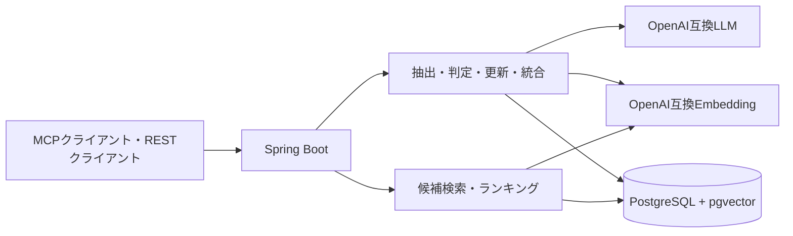

# MCP Memory

AIアシスタントの会話から、あとで役立つ情報を選んで記憶するセルフホスト型サービスです。会話全文を保存するのではなく、事実・好み・出来事・プロジェクト・手順を区別し、出典と変更履歴を残します。

**Java 25 / Spring Boot 4.1.1 / Spring AI 2.0.1 / PostgreSQL 18 + pgvector / Gradle 9.7.1**。REST APIと、Streamable HTTPのMCPサーバーを提供します。

## できること

- 会話から記憶候補を抽出し、根拠・信頼度・将来の有用性を判定する
- 同じ記憶の重複を抑え、更新・矛盾・置き換えを履歴として残す
- ベクトル検索とPostgreSQL全文検索を組み合わせ、重要度・新しさ・使用頻度で順位を付ける
- 検索スコアの内訳を確認し、記憶を実際に使った回数を明示的に記録する
- 関連する記憶を小さいバッチで整理・要約し、元になった記憶との関係を残す
- 元の記憶が変わったときに、それを根拠とする要約を失効させる
- 保存済みのベクトルと記憶の関係を、読み取り専用のマップで確認する

## 起動する

必要なものはDocker Composeです。アプリもコンテナで実行する場合、ホストへのJavaインストールは不要です。

```sh
git clone https://github.com/agedofu-git/mcp-memory-public.git
cd mcp-memory-public
cp .env.example .env
```

`.env`を編集し、次を設定してください。

| 設定 | 内容 |
| --- | --- |
| `DB_PASSWORD` | 自分で生成したDBパスワード。空欄のままではComposeは起動しません |
| `EMBEDDING_BASE_URL` / `EMBEDDING_MODEL` | OpenAI互換の埋め込みAPI。URLには`/v1`を含めます |
| `EMBEDDING_DIMENSIONS` | モデルの出力次元。初回マイグレーション前に決めます |
| `LLM_BASE_URL` / `LLM_MODEL` | OpenAI互換のチャットAPI。抽出・判定・統合に使います |
| `EMBEDDING_API_KEY` / `LLM_API_KEY` | 利用先で必要な場合だけ設定します |

コンテナからホスト側のAIサーバーへ接続する場合、`localhost`の代わりに`host.docker.internal`を使います。ほかの端末にあるAIサーバーは、その端末の到達可能なURLを指定してください。

```sh
docker compose --profile app up -d --build
curl -fsS http://127.0.0.1:8080/api/health
```

DBとアプリの公開先は既定でlocalhostに限定されています。`SERVER_PORT`はホスト側の公開ポートです。アプリコンテナ内では8080番を使います。

### Javaで直接実行する

Java 25を用意し、DBだけComposeで起動します。Springは`.env`を自動で読み込まないため、直接実行では設定値をプロセス環境変数として渡します。

```sh
docker compose up -d db
# .envで決めた値を環境変数として設定してから実行
./gradlew bootRun
```

WindowsのPowerShellでは、同梱スクリプトが`.env`を実行せず文字列として読み込みます。

```powershell
.\scripts\run-local.ps1
```

## MCPで接続する

MCPクライアントには、**Streamable HTTP**の接続先として`http://127.0.0.1:8080/mcp`を登録します。別端末から使う場合は、SSHトンネルや認証付きのリバースプロキシを経由してください。

| ツール | 用途 |
| --- | --- |
| `memory_search` | 自然言語で記憶を検索する |
| `memory_ingest` | 会話から長期記憶を抽出・更新する |
| `memory_get` | UUIDを指定して記憶を取得する |
| `memory_list` | 記憶を一覧にする |
| `memory_history` | 変更履歴・根拠・関連する記憶を調べる |

MCPの通信設定は`src/main/resources/application.properties`、ツールは`MemoryMcpTools.java`にあります。[Spring AIのMCP設定](https://docs.spring.io/spring-ai/reference/api/mcp/mcp-server-boot-starter-docs.html)も参照してください。

## REST APIを試す

AI providerを設定してから実行します。以下は架空の会話を使った例です。

```sh
# 会話から記憶を抽出
curl -sS http://127.0.0.1:8080/api/memories/ingest \
  -H 'Content-Type: application/json' \
  -d '{"conversationId":"demo-1","userMessage":"個人用の記憶検索にPostgreSQLとpgvectorを使いたい。","project":"demo"}'

# 検索とスコア内訳
curl -sS http://127.0.0.1:8080/api/memories/search \
  -H 'Content-Type: application/json' \
  -d '{"query":"記憶検索に使うデータベースは？","limit":5,"project":"demo","debug":true}'
```

CRUD、履歴、アーカイブ、統合の例は[設計・設定・REST API](docs/architecture.md)にあります。取り込み・統合は一部だけ成功する場合があるため、HTTPステータスに加えて`complete`と結果一覧を確認してください。

## 構成



`controller/`と`mcp/`が入口、`ingestion/`が会話の取り込み、`ranking/`が検索スコア、`consolidation/`が記憶の整理、`repository/`がSQLと短い書き込みトランザクションを担当します。プロンプトとFlywayマイグレーションは`src/main/resources/`で編集できます。

## ビルドとテスト

Java 25を使います。通常テストはDB・Docker・実際のAI APIを必要としません。

```sh
./gradlew build --no-daemon
```

実DBテストはTestcontainersで専用のPostgreSQL + pgvectorを起動します。Dockerを使える環境で実行してください。AI providerはテスト用の偽物を使います。

```sh
./gradlew integrationTest --no-daemon
```

CIは両方を実行します。テスト結果は`build/reports/tests/`、実行可能JARは`build/libs/`に生成されます。既存DBを使うテストの設定と確認済みの検証結果は[運用ガイド](docs/operations.md)を参照してください。

## 運用と制限

- **アプリ内の認証・ユーザー分離は未実装です。** RESTとMCPの両方を保護してください。コードの公開は、稼働中サービスや保存データの公開を意味しません。
- LLMの誤抽出・誤分類は完全には防げません。重要な情報は根拠と履歴を確認してください。
- PostgreSQLの`simple`全文検索は日本語の形態素解析をしません。日本語の検索品質は埋め込みモデルの選択と評価が必要です。
- 埋め込みモデルや次元の変更には再埋め込みとDBスキーマの計画が必要です。`.env`の書き換えだけで既存データを移行できません。
- `.env`、APIキー、DBデータ、記憶を含むHTML、バックアップ、SSH秘密鍵はGit管理から除外します。

[運用ガイド](docs/operations.md)に起動・停止・更新・バックアップ・SSH接続・公開手順をまとめています。[ベクトルマップ](docs/vector-graph.md)、[設計仕様](SPEC.md)、[過去のレビュー](docs/history/implementation-review-20260906.md)も参照できます。

ライセンスは未設定です。
