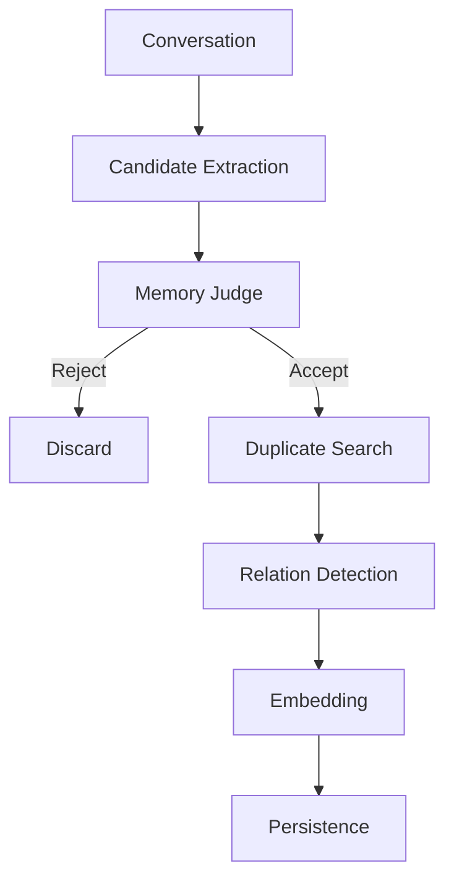
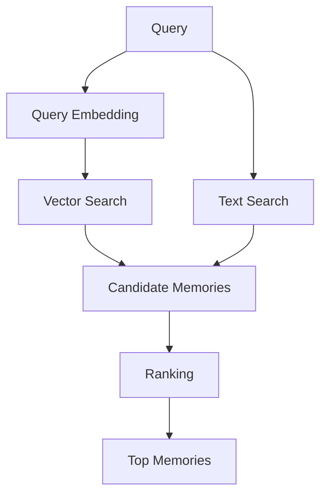

# AI Long-Term Memory System Build Prompt

I want you to build a practical long-term memory system for an AI assistant.

Do not stop at architecture, high-level discussion, or pseudocode.

Inspect the current repository, create a concrete implementation plan, then actually implement a working MVP, tests, database migrations, Docker setup, and documentation.

If the repository is empty, initialize the project yourself.

Do not ask me questions unless a decision is genuinely blocking.
For non-critical decisions, choose a sensible default, document the assumption, and continue.

The final result should be something I can actually run, inspect, modify, and extend myself.

# Goal

Build a self-hostable long-term memory service that allows an AI assistant to:

1. Store useful information extracted from conversations
2. Retrieve semantically and contextually relevant memories later
3. Distinguish different kinds of memory
4. Update or supersede outdated memories
5. Avoid storing duplicates and low-value information
6. Detect contradictions
7. Consolidate related memories periodically
8. Reduce the influence of stale or unimportant memories over time
9. Preserve provenance and history
10. Provide transparent and debuggable retrieval scoring
11. Run reasonably on a small personal server

The system should feel more like long-term memory than a simple vector database containing chat logs.

It should be understandable and hackable by one developer.

Avoid unnecessary complexity, enterprise architecture, excessive abstractions, and premature optimization.

# Preferred stack

Use:

- Java 25
- Spring Boot 4
- PostgreSQL
- pgvector
- Gradle
- Docker Compose

Target Java 25 explicitly.

Configure Gradle Toolchains so builds consistently use Java 25.

Example intent:

```kotlin
java {
    toolchain {
        languageVersion = JavaLanguageVersion.of(25)
    }
}
```

Do not silently fall back to an older JDK.

Use a recent Gradle version compatible with Java 25.

Before selecting dependencies, verify that they are compatible with Java 25 and Spring Boot 4.

Prefer current stable versions over legacy dependencies.

# Modern Java requirements

Write idiomatic modern Java 25.

Use modern language features where they genuinely improve readability and design, including:

- records
- sealed classes/interfaces where appropriate
- pattern matching
- switch expressions
- text blocks
- improved collection APIs
- virtual threads where they actually provide value

Do not force modern features where they make code harder to understand.

Do not use preview features unless there is a clear benefit.

If preview features are used:

- explain why
- configure Gradle correctly
- document the requirement in the README

Do not overuse Lombok.

Prefer:

- records
- constructors
- standard Java language features

over Lombok-generated boilerplate when practical.

# Core engineering principles

Optimize for:

- correctness
- simplicity
- inspectability
- debuggability
- self-hosting
- maintainability
- extensibility
- retrieval quality

Do NOT optimize for:

- massive scale
- microservices
- Kubernetes
- distributed systems
- event-driven architecture for its own sake
- huge RAG frameworks
- complicated enterprise patterns
- unnecessary interfaces
- unnecessary factories
- unnecessary DTO layers

This is initially a single-user personal AI memory service.

Hundreds of thousands of memories would already be more than enough for the foreseeable future.

# AI provider abstraction

The system must not depend specifically on OpenAI.

For embeddings, define a clean provider abstraction.

Initially support an OpenAI-compatible embeddings API such as:

`POST /v1/embeddings`

The following should be configurable through environment variables or application configuration:

- base URL
- model name
- API key
- timeout
- embedding dimensions if necessary

The system should later be able to work with local OpenAI-compatible servers without major architectural changes.

Examples might include:

- llama.cpp server
- vLLM
- Ollama-compatible adapters
- other OpenAI-compatible APIs

Do not tightly couple domain logic to a particular HTTP provider.

# LLM abstraction

Memory extraction, contradiction detection, consolidation, and similar tasks may require an LLM.

Create an abstraction for LLM calls.

Support an OpenAI-compatible API initially.

Keep provider-specific networking code separate from memory logic.

Configuration should support:

- base URL
- model
- API key
- timeout
- temperature
- maximum output tokens where relevant

The application should be able to swap providers later.

# Memory model

Do NOT treat every memory as an undifferentiated vector entry.

Support at least the following memory categories.

## FACT

Relatively stable factual information.

Examples:

- user's server has 32 GB RAM
- user's primary programming language is Java
- user's desktop GPU is an RTX-class GPU

## PREFERENCE

Preferences, likes, dislikes, tendencies, habitual choices.

Examples:

- prefers Java over Python for backend systems
- prefers self-hosting
- dislikes unnecessary abstractions

## EPISODIC

Things that happened at a particular time.

Examples:

- configured pgvector today
- debugged an embedding issue
- changed a server configuration

## PROJECT

Ongoing goals, projects, implementation choices, progress, blockers, plans.

Examples:

- building a long-term memory system
- planning to use PostgreSQL and pgvector
- implemented memory search but consolidation is unfinished

## PROCEDURAL

Instructions, routines, workflows, recurring ways of doing something.

Examples:

- deployment procedure
- preferred project initialization workflow
- how a recurring task should be handled

# Memory entity

Each memory should contain at least:

- id
- type
- content
- normalized content if useful
- embedding
- createdAt
- updatedAt
- lastAccessedAt
- source
- sourceConversationId
- importance score
- confidence score
- access count
- tags
- metadata
- active status
- archived status
- superseded status
- optional supersedesMemoryId
- optional parentMemoryId
- optional consolidationGroupId

Use sensible database types.

Keep the schema extensible.

Prefer UUIDs unless there is a compelling reason to use something else.

# Provenance

Every memory should preserve where it came from.

The system should be able to answer:

- which conversation created this memory?
- was this memory directly extracted or generated by consolidation?
- which older memories contributed to a consolidated memory?
- which memory superseded another one?

Do not discard provenance during merging or consolidation.

# Ingestion pipeline

Create an endpoint similar to:

`POST /api/memories/ingest`

Example input:

```json
{
  "conversationId": "conversation-123",
  "userMessage": "I upgraded my home server from 16 GB to 32 GB of RAM.",
  "assistantMessage": "That should give your VMs a lot more breathing room."
}
```

The ingestion process must NOT blindly save the full conversation.

Implement a pipeline conceptually similar to:

```text
conversation
    -> candidate extraction
    -> memory usefulness judgment
    -> normalization
    -> duplicate search
    -> contradiction/update detection
    -> merge / ignore / supersede decision
    -> embedding generation
    -> persistence
```

# Candidate extraction

Use an LLM-based extractor initially.

The extractor should return structured JSON.

Example:

```json
{
  "memories": [
    {
      "type": "FACT",
      "content": "The user's home server has 32 GB of RAM.",
      "importance": 0.7,
      "confidence": 0.98,
      "tags": [
        "server",
        "hardware",
        "ram"
      ]
    }
  ]
}
```

Use strongly typed Java records/classes for the structured response.

Validate LLM output.

Do not trust model-generated JSON blindly.

Handle malformed output gracefully.

# Prompt organization

Do not hardcode large LLM prompts inside Java source files.

Store prompts in editable resource files.

For example:

`src/main/resources/prompts/`

Possible files:

- memory-extraction.txt
- memory-judge.txt
- contradiction-detection.txt
- memory-consolidation.txt

Create a simple prompt loading mechanism.

# What should be remembered

The system should prefer remembering information that is likely to be useful later.

Examples:

- stable user preferences
- important technical environment details
- project decisions
- ongoing goals
- recurring workflows
- significant events
- corrections to previous facts

# What should NOT be remembered

Avoid storing:

- greetings
- filler
- temporary chatter
- obvious acknowledgements
- meaningless small talk
- duplicate information
- content that only makes sense for a few seconds
- assistant wording that contains no new information
- unsupported assumptions
- speculative facts stated by the assistant
- information with extremely low confidence

The system should be conservative about creating memories.

A smaller amount of useful memory is preferable to a huge noisy memory store.

# Memory usefulness judgment

Implement a memory judgment stage.

For every extracted candidate, decide whether the memory is worth persisting.

The decision should consider:

- future usefulness
- specificity
- confidence
- stability
- novelty
- whether the information is already stored
- whether it is too temporary
- whether it is likely to affect future responses

Store or log the reason for rejecting candidates in debug mode.

# Duplicate detection

Before inserting a memory, search existing memories for semantically similar entries.

Example:

Existing:

`The user prefers Java.`

New:

`The user's preferred programming language is Java.`

These should not become two independent active memories.

Use:

- vector similarity
- normalized text comparison
- possibly keyword overlap
- memory type

to help detect duplicates.

Similarity thresholds must be configurable.

For near-duplicates, support decisions such as:

- IGNORE
- UPDATE
- MERGE
- SUPERSEDE

Do not hide this logic inside a giant service method.

Keep duplicate decision logic understandable and testable.

# Contradictions and updates

Handle changing facts.

Example:

Old:

`The user's server has 16 GB RAM.`

New:

`The user's server has 32 GB RAM.`

Do not simply delete the old record.

Instead:

1. create or update the new memory
2. mark the old memory as superseded
3. link the memories
4. preserve historical information

Normal retrieval should prefer only active, non-superseded memories.

Historical queries should be able to include superseded memories.

# Contradiction detection

Semantic similarity alone is not enough to detect contradictions.

Create a contradiction/update detection stage.

It should distinguish roughly between:

- duplicate
- compatible additional information
- refinement
- update
- contradiction
- unrelated information

The first implementation may use an LLM.

Keep the decision representation strongly typed.

For example:

```java
enum MemoryRelation {
    DUPLICATE,
    COMPATIBLE,
    REFINEMENT,
    UPDATE,
    CONTRADICTION,
    UNRELATED
}
```

Use better naming if appropriate.

# Embeddings

Generate embeddings only when appropriate.

Avoid unnecessary repeated embedding calls.

Consider storing an embedding model identifier with each memory so future model migrations are possible.

Design the schema so embeddings can eventually be regenerated.

Do not assume embedding dimensions will never change.

# Retrieval API

Implement:

`POST /api/memories/search`

Example request:

```json
{
  "query": "What database was I planning to use for my AI memory project?",
  "limit": 10
}
```

Support optional filters such as:

- memory type
- active only
- include archived
- include superseded
- tags
- project
- minimum importance
- date range

Use sensible defaults.

# Retrieval quality

Retrieval must be better than simple cosine similarity.

Create an explicit ranking score using a combination of factors such as:

- semantic similarity
- importance
- recency
- access frequency
- confidence
- memory type
- keyword / text relevance
- active/superseded state

Conceptually:

```text
score =
      semanticSimilarity * semanticWeight
    + importance * importanceWeight
    + recencyScore * recencyWeight
    + accessScore * accessWeight
    + confidence * confidenceWeight
    + textScore * textWeight
```

This is only conceptual.

Choose a reasonable initial formula.

Do not make the exact ranking formula impossible to change.

Put ranking weights in configuration.

# Retrieval debug mode

The retrieval API should optionally return scoring details.

Example:

```json
{
  "memory": {
    "id": "...",
    "type": "PROJECT",
    "content": "The user plans to use PostgreSQL with pgvector for the memory system."
  },
  "score": 0.83,
  "components": {
    "semantic": 0.91,
    "importance": 0.80,
    "recency": 0.55,
    "access": 0.30,
    "confidence": 0.95,
    "text": 0.60
  }
}
```

This is important.

I want to be able to understand WHY a memory was retrieved.

# Retrieval access tracking

When a memory is actually selected for use:

- increment access count
- update lastAccessedAt

Do this sensibly.

Avoid turning every search result preview into a fake access event if possible.

Differentiate search from actual memory usage if useful.

# Hybrid search

Consider implementing hybrid retrieval:

- pgvector semantic similarity
- PostgreSQL text search or simple keyword relevance

Do not add Elasticsearch or another external search engine.

Keep the initial stack PostgreSQL-only.

# Memory decay

Implement a simple and understandable decay system.

Low-value memories that have not been accessed for a long time should gradually become less likely to be retrieved.

Decay should NOT mean deleting data.

Different memory types should decay differently.

For example:

FACT:
very slow decay

PREFERENCE:
slow decay

PROJECT:
moderate decay depending on activity

PROCEDURAL:
slow decay

EPISODIC:
faster decay

Importance and repeated access should reduce effective decay.

Keep the formula explicit and testable.

# Example decay concept

A possible conceptual model:

```text
effectiveImportance =
    baseImportance
    * typeDecayFactor
    * timeDecayFactor
    * accessBoost
```

You may choose a better formulation.

The priority is understandability rather than mathematical sophistication.

# Archiving

Do not physically delete memories simply because they become stale.

Support archiving separately.

An archived memory should normally not appear in ordinary retrieval.

Historical/debug queries should still be able to access it.

# Deletion

Implement explicit deletion separately.

DELETE should be intentional.

Avoid automatic permanent deletion during normal memory maintenance.

# Memory consolidation / "sleep"

Implement a consolidation system.

Provide a manual endpoint initially:

`POST /api/memories/consolidate`

Later it should also be possible to run it on a schedule.

# Consolidation responsibilities

The consolidation process should inspect related memories and be capable of:

- merging repeated episodic memories
- creating higher-level summaries
- reducing duplicate noise
- identifying outdated information
- detecting likely contradictions
- promoting repeatedly useful information
- reducing effective importance of stale noise
- optionally archiving low-value memories
- generating useful PROJECT or FACT memories from repeated episodes

Example:

Source memories:

- Worked on pgvector today.
- Added embedding API support.
- Implemented memory search.
- Debugged ranking logic.

Possible consolidated memory:

`The user is actively building an AI long-term memory system using pgvector and embedding-based retrieval.`

Do not automatically destroy source memories.

Maintain links from consolidated memories to their sources.

# Consolidation provenance

If a memory is generated from multiple memories, store relationships.

A consolidated memory should know which memories contributed to it.

Design a relation table if that is cleaner than embedding this in JSON.

# Sleep process

Think of consolidation somewhat like a simplified sleep cycle.

Possible phases:

1. identify clusters of related memories
2. remove or mark duplicates
3. detect evolving facts
4. summarize repeated episodes
5. promote important recurring information
6. update importance
7. apply decay
8. archive low-value stale memories where appropriate

Do not over-engineer this in the MVP.

Start with something functional and understandable.

# Memory clusters

For consolidation, related memories can initially be grouped using:

- embedding similarity
- tags
- memory type
- source project
- creation time

Do not introduce an external clustering platform.

A simple approach is acceptable initially.

# API requirements

At minimum implement:

- `POST   /api/memories/ingest`
- `POST   /api/memories`
- `GET    /api/memories/{id}`
- `POST   /api/memories/search`
- `PATCH  /api/memories/{id}`
- `DELETE /api/memories/{id}`
- `POST   /api/memories/consolidate`
- `GET    /api/health`

Also consider useful endpoints such as:

- `GET /api/memories`
- `GET /api/memories/{id}/history`
- `GET /api/debug/memories/{id}`
- `POST /api/memories/{id}/archive`

Only add them when useful.

# Manual memory creation

`POST /api/memories` should allow manually inserting a memory.

Manual memories may be treated differently from automatically extracted memories.

Consider giving manual memories higher trust or marking their origin explicitly.

# Memory editing

PATCH should support editing relevant fields.

If content changes materially, regenerate the embedding.

Maintain updatedAt correctly.

# Database

Use PostgreSQL with pgvector.

Create proper database migrations.

Use Flyway unless there is a compelling reason to use another migration tool.

# Database schema

Create tables that clearly represent:

- memories
- memory relationships if needed
- consolidation relationships
- possibly ingestion events
- possibly memory access events if useful

Do not create unnecessary tables.

# Vector indexing

Use an appropriate pgvector index.

Prefer HNSW unless there is a strong reason to choose something else.

Document:

- why it was selected
- relevant configuration
- tradeoffs
- when the index becomes useful

For tiny datasets, correctness is more important than premature optimization.

# PostgreSQL indexes

Add useful indexes for:

- active status
- archived status
- memory type
- createdAt
- updatedAt
- lastAccessedAt
- sourceConversationId
- superseded state
- tags where useful
- vector search

Do not blindly index every column.

# Architecture

Use a clean but simple architecture.

Something roughly like:

```text
controller
domain
service
repository
embedding
llm
ranking
ingestion
consolidation
config
```

is fine.

Adapt if you have a cleaner structure.

Do not build an elaborate hexagonal architecture unless it clearly helps.

# Suggested responsibilities

Possible components:

- MemoryController
- MemoryService
- MemoryRepository
- MemoryIngestionService
- MemoryExtractor
- MemoryJudge
- DuplicateDetector
- MemoryRelationDetector
- EmbeddingClient
- LlmClient
- MemorySearchService
- MemoryRanker
- MemoryConsolidationService
- MemoryDecayPolicy

These are examples, not mandatory class names.

Avoid giant "God services".

# Domain design

Use domain-specific types where practical.

Examples:

```java
record MemoryCandidate(...)

record SearchScoreComponents(...)

record MemorySearchResult(...)

enum MemoryType

enum MemoryRelation
```

Use immutable structures where practical.

# Configuration

Expose important tuning parameters through application configuration.

Examples:

```yaml
memory:
  ranking:
    semantic-weight:
    importance-weight:
    recency-weight:
    access-weight:
    confidence-weight:
    text-weight:

  duplicate:
    similarity-threshold:

  decay:
    fact-half-life:
    preference-half-life:
    episodic-half-life:
    project-half-life:
    procedural-half-life:

  extraction:
    minimum-confidence:
    minimum-importance:
```

Do not hardcode tuning constants throughout the codebase.

# Observability

Add useful structured logging.

Log important decisions such as:

- candidate memories extracted
- candidate rejected
- rejection reason
- duplicate detected
- relation classification
- memory superseded
- memory merged
- embedding failures
- retrieval score components
- consolidation actions
- archived memory

Never log:

- API keys
- authorization headers
- secrets

Be careful about logging full sensitive conversation contents.

Debug logs may include memory content where appropriate, but make this configurable.

# Error handling

Provide sensible API error responses.

Handle:

- embedding provider unavailable
- LLM provider unavailable
- malformed LLM JSON
- invalid memory type
- invalid request
- missing memory
- database failure
- vector dimension mismatch

Use Spring Boot error handling cleanly.

Avoid exposing stack traces in normal API responses.

# Resilience

External AI services may fail.

Use reasonable:

- connection timeout
- request timeout
- limited retry behavior

Do not create endless retry loops.

A failed embedding or extraction should not corrupt the database.

# Transactions

Use transactions where memory updates must remain consistent.

For example:

- superseding an old memory and creating a new one
- consolidation relationships
- merges

Avoid holding database transactions open while waiting for slow external LLM calls unless necessary.

# Concurrency

Keep concurrency design simple.

Use virtual threads where they make sense for blocking external HTTP/database-related orchestration.

Do not introduce reactive programming merely because it exists.

Prefer straightforward imperative code unless reactive behavior provides a clear benefit.

# HTTP client

Use a modern HTTP client appropriate for Spring Boot 4 / Java 25.

Keep AI provider networking isolated behind clean interfaces.

Avoid provider logic leaking into memory services.

# Serialization

Use Jackson through Spring Boot.

Use records for API DTOs where appropriate.

Validate request input.

# Validation

Use Jakarta Bean Validation for API requests when appropriate.

Examples:

- non-empty query
- valid limits
- scores between 0 and 1
- valid content length

# Testing

Add meaningful automated tests.

At minimum test:

1. manual memory creation
2. memory retrieval by ID
3. memory update
4. memory deletion
5. candidate extraction parsing
6. usefulness filtering
7. duplicate detection
8. semantic retrieval
9. ranking formula
10. ranking debug components
11. superseding outdated information
12. contradiction/update classification
13. decay calculation
14. archival behavior
15. consolidation behavior where practical
16. malformed provider response handling
17. configuration loading

# Database integration tests

Use Testcontainers for PostgreSQL + pgvector integration tests if practical.

Tests should use a real PostgreSQL environment for vector-specific behavior.

Do not rely entirely on H2 for database behavior that differs from PostgreSQL.

# Provider testing

Do not require a real paid API for normal automated tests.

Create fake or stub implementations for:

- EmbeddingClient
- LlmClient

Integration with a real OpenAI-compatible endpoint may be a separate optional test profile.

# Test data

Use realistic memory examples.

Examples should include:

Duplicate:

- `User prefers Java.`
- `Java is the user's preferred language.`

Update:

- `User's server has 16 GB RAM.`
- `User upgraded the server to 32 GB RAM.`

Project:

- `User plans to build memory search using PostgreSQL and pgvector.`

Temporary noise:

- `I'm hungry right now.`

Preference:

- `User prefers self-hosted software when practical.`

# Docker development environment

Provide `docker-compose.yml`.

It should start PostgreSQL with pgvector support.

Use a maintained PostgreSQL/pgvector image.

Create sensible defaults for local development.

The project should be runnable with something close to:

```bash
docker compose up -d
./gradlew bootRun
```

# Environment configuration

Provide:

`.env.example`

Include placeholders for things such as:

```text
DB_HOST
DB_PORT
DB_NAME
DB_USER
DB_PASSWORD

EMBEDDING_BASE_URL
EMBEDDING_API_KEY
EMBEDDING_MODEL

LLM_BASE_URL
LLM_API_KEY
LLM_MODEL
```

Never commit real API keys or secrets.

# Spring configuration

Use `application.yml` or equivalent.

Support environment-variable overrides.

Keep local development easy.

# Health check

Implement:

`GET /api/health`

At minimum indicate whether the application itself is running.

Optionally expose database/provider health carefully.

Do not leak credentials or internal secrets.

# README

Create a thorough README.

Explain:

- what this project does
- why it is not simply a chat log vector store
- architecture
- package structure
- memory lifecycle
- memory types
- ingestion pipeline
- extraction
- duplicate detection
- contradiction handling
- superseding
- retrieval
- ranking formula
- ranking debug output
- decay
- consolidation / sleep
- provenance
- database schema
- pgvector setup
- configuration
- environment variables
- how to run
- how to test
- how to use local AI providers
- how to switch embedding providers
- how to switch LLM providers
- API examples
- current limitations
- future improvements

# API examples

Include curl examples for:

- ingesting a conversation
- manually creating a memory
- searching memories
- retrieving a memory
- updating a memory
- consolidation
- deletion

# Documentation diagrams

Include simple Mermaid diagrams in the README where useful.

For example, ingestion:



And retrieval:



# Security

This is a personal system, but use basic security hygiene.

At minimum:

- never log secrets
- do not commit `.env`
- validate input
- avoid SQL injection
- use parameterized queries / ORM mechanisms
- protect against absurdly large request payloads
- document that authentication is not yet production-ready if auth is omitted

Do not build a giant authentication system unless necessary for the MVP.

# Performance

Optimize sensibly for a small server.

Avoid:

- loading all memories into Java to calculate similarity
- unnecessary repeated embedding calls
- unnecessary LLM calls
- N+1 database queries
- massive in-memory clustering

Push vector search into PostgreSQL/pgvector.

# Cost awareness

LLM calls and embedding calls may cost money or GPU time.

Try to avoid unnecessary calls.

Examples:

- text-identical memories should not need expensive contradiction analysis
- obvious low-value messages may be rejected before embedding
- embeddings should be reused when possible
- consolidation should process batches rather than repeatedly reprocessing everything

Document important cost/latency tradeoffs.

# Memory safety against hallucination

A major failure mode is the LLM inventing a memory that was never supported by the source conversation.

The extractor must be instructed to:

- only extract information supported by the provided conversation
- avoid guessing
- avoid converting assistant speculation into user facts
- keep confidence low when uncertain
- emit no memory when nothing useful is present

Preserve source conversation IDs so extracted memories can be audited.

# Extractor prompt requirements

Create an extraction prompt that emphasizes:

- extract only durable useful information
- do not summarize the whole conversation
- do not invent facts
- do not infer sensitive details without explicit evidence
- avoid temporary states unless genuinely important
- output structured JSON only
- zero memories is a valid result

# Judge prompt requirements

Create a memory judge prompt that asks whether a candidate is worth storing.

Possible criteria:

- likely useful in future conversations
- sufficiently specific
- supported by source
- not redundant
- not trivial
- not fleeting
- reasonable confidence

Return structured output.

# Relation detection prompt requirements

The relation detector should compare a candidate with an existing memory and determine whether they are:

- DUPLICATE
- COMPATIBLE
- REFINEMENT
- UPDATE
- CONTRADICTION
- UNRELATED

It should also provide a short machine-readable or structured rationale.

Do not rely on the rationale for database correctness.

# Consolidation prompt requirements

The consolidation prompt should:

- summarize only information supported by source memories
- preserve important distinctions
- avoid inventing facts
- avoid collapsing contradictory memories into a false summary
- prefer useful durable knowledge
- return structured output
- reference source memory IDs

# Ranking implementation

Implement ranking separately from retrieval candidate generation.

Candidate generation may retrieve more memories than the final requested limit.

For example:

```text
query top 50 vector/text candidates
-> calculate ranking
-> return final top 10
```

Make candidate pool size configurable.

# Recency scoring

Use a sensible time-decay calculation.

Avoid a crude binary recent/not-recent flag.

Keep the formula documented and testable.

# Importance

Importance should remain in a bounded range such as:

`0.0 to 1.0`

Validate values.

Importance represents long-term usefulness, not simply emotional intensity.

# Confidence

Confidence should remain in a bounded range such as:

`0.0 to 1.0`

Confidence represents how strongly the source supports the memory.

# Access score

Access frequency must not grow without bound and dominate the ranking forever.

Use a logarithmic, capped, or otherwise normalized access score.

# Type-aware ranking

Memory type may influence retrieval.

For example:

A PROJECT query might favor PROJECT memories.

A question about stable user information might favor FACT or PREFERENCE.

Keep any type boost small and configurable.

# Future model migration

Design with the expectation that embedding models may change.

Store enough metadata to know:

- embedding provider
- embedding model
- embedding dimensions
- embedding version if applicable

Do not implement a huge migration framework now.

Just make future re-embedding possible.

# Auditability

I should be able to inspect a memory and understand:

- original content
- memory type
- source
- confidence
- importance
- embedding model
- whether it was consolidated
- whether it superseded something
- whether it has been superseded
- retrieval usage
- creation/update timestamps

# Suggested package layout

Use something approximately like:

```text
src/main/java/.../

config/
controller/
domain/
repository/
service/

embedding/
llm/

ingestion/
ranking/
consolidation/
```

You can improve the structure if appropriate.

Do not create dozens of tiny packages with one file each unless it clearly improves organization.

# Persistence approach

Choose either Spring Data JPA or another sensible Spring-native persistence approach.

However, pgvector queries may require custom SQL.

Do not force vector search through awkward ORM abstractions.

It is acceptable to use:

- Spring Data for ordinary CRUD
- JdbcClient / native SQL for vector search

if that results in clearer code.

# Implementation strategy

Follow this process.

## Phase 1 — inspect and plan

1. Inspect the repository.
2. Determine whether a project already exists.
3. Briefly describe the architecture you will use.
4. List important assumptions.
5. Create a concrete TODO/checklist.
6. Verify Java 25 / Spring Boot 4 compatibility.

Then immediately begin implementation.

Do not wait for my approval unless something is genuinely blocking.

## Phase 2 — project foundation

Create:

- Gradle configuration
- Java 25 toolchain
- Spring Boot application
- Docker Compose
- PostgreSQL + pgvector
- migrations
- configuration
- health endpoint

## Phase 3 — memory CRUD

Implement:

- memory domain model
- repository
- create
- get
- update
- delete
- archive
- basic tests

## Phase 4 — embeddings and search

Implement:

- EmbeddingClient abstraction
- OpenAI-compatible implementation
- query embedding
- pgvector search
- ranking
- search API
- ranking debug mode
- tests

## Phase 5 — ingestion

Implement:

- LlmClient
- candidate extractor
- candidate validator
- memory judge
- prompt files
- ingestion endpoint
- tests

## Phase 6 — duplicates and updates

Implement:

- duplicate detection
- memory relation classification
- merge/update/supersede behavior
- provenance
- tests

## Phase 7 — decay

Implement:

- type-aware decay
- ranking integration
- archival primitives
- tests

## Phase 8 — consolidation

Implement:

- consolidation candidate selection
- related-memory grouping
- LLM consolidation abstraction
- source relationships
- manual consolidation endpoint
- tests where practical

## Phase 9 — documentation

Complete the README.

Add curl examples.

Add architecture diagrams.

Document limitations.

# Build discipline

Keep the application buildable throughout development.

After every major phase:

- run compilation
- run tests
- fix failures
- inspect warnings where meaningful

Do not leave obviously broken code for later phases.

# Definition of done

The MVP is complete when I can:

1. start PostgreSQL with Docker Compose
2. start the application using Java 25
3. configure an OpenAI-compatible embedding endpoint
4. configure an OpenAI-compatible LLM endpoint
5. ingest a conversation
6. see useful memories extracted
7. avoid obvious duplicate memories
8. update/supersede outdated information
9. search semantically
10. inspect retrieval ranking components
11. run memory consolidation
12. inspect provenance
13. run automated tests
14. understand the project from the README

# Important behavioral instruction

Do not merely tell me what code I should write.

Actually:

- create files
- edit files
- run commands
- build the project
- run tests
- fix errors
- continue until the MVP is operational

If an implementation choice is uncertain but non-blocking, choose a reasonable solution and continue.

Do not spend the entire session discussing architecture.

# Final review

After implementation, perform a critical review of the system.

Evaluate:

- what gets remembered
- what should not be remembered
- duplicate accumulation
- contradiction behavior
- retrieval quality
- ranking bias
- memory decay
- consolidation quality
- provenance
- hallucinated memories
- malformed LLM responses
- latency
- unnecessary LLM usage
- pgvector query efficiency
- database design
- Java code quality
- Spring Boot architecture

Create realistic conversation scenarios.

Simulate how memories might evolve across multiple days or weeks.

Identify obvious design flaws.

Where practical:

- write regression tests that expose them
- fix the implementation

Prioritize real memory quality over architectural elegance.

# Final response

At the end, give me:

1. a concise summary of what was implemented
2. the final architecture
3. important files/modules
4. database schema overview
5. how to run the project
6. how to configure AI providers
7. how to test it
8. example API calls
9. known limitations
10. likely failure modes
11. recommended next implementation steps

Do not claim something works unless you actually ran the relevant build/test where possible.
