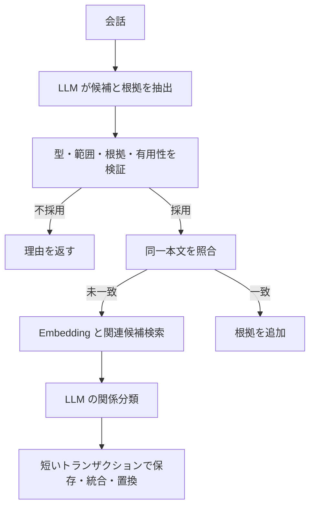
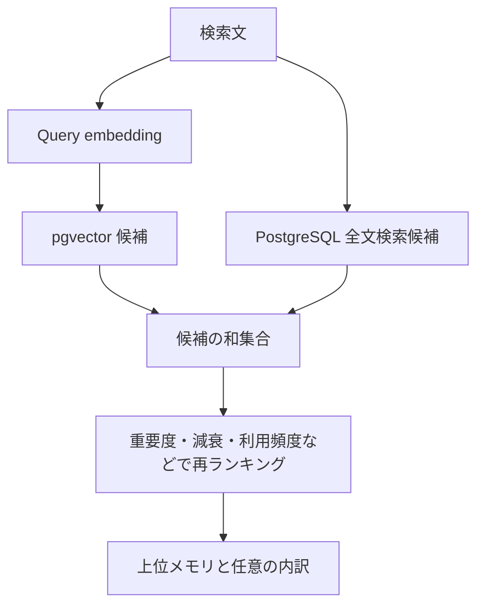

# 設計・設定・REST API

現在のMCP接続と起動手順は [README](../README.md) を参照してください。

## 構成とデータモデル

Spring MVC controller → domain service → Spring JDBC repository の構成です。外部 AI 呼び出しは `EmbeddingClient` / `LlmClient` インターフェースの後ろに分離しています。HTTP と JDBC はブロッキング処理で、リクエスト処理には Java の virtual threads を使用します。

| 場所 | 役割 |
| --- | --- |
| `controller/`, `domain/` | API records、Jakarta Validation、5 種類のメモリ、エラー形式 |
| `service/` | CRUD、検索、使用記録 |
| `repository/` | SQL、ベクトル候補検索、短い書き込みトランザクション |
| `embedding/`, `llm/` | provider 接続、JSON 検証、プロンプト読み込み |
| `ingestion/` | 抽出、有用性判定、重複・更新判断 |
| `ranking/` | 明示的なランキングと種類別減衰 |
| `consolidation/` | 小さいバッチの関連づけ・要約・任意のアーカイブ |
| `src/main/resources/prompts/` | 編集可能な 4 種類のプロンプト |
| `src/main/resources/db/migration/` | Flyway V1 / V2 / V3（派生記憶の失効状態） |

DB の主要テーブル:

| テーブル | 内容 |
| --- | --- |
| `memories` | UUID、種類、本文、正規化本文、vector、provider/model/dimensions/version、時刻、出典、importance/confidence、使用回数、JSONB tags/metadata、状態、親・置換元・統合グループ、更新 version |
| `memory_revisions` | 変更時の JSONB スナップショット（巨大な embedding は除外） |
| `memory_links` | SUPERSEDES / REFINES / CONTRADICTS / CONSOLIDATED_FROM と参照時の対象 version |
| `memory_evidence` | 会話 ID、出典区分、根拠となるユーザー発言の抜粋 |
| `memory_state` | 同時書き込みの古い判断を拒否する単一の世代番号 |

通常の検索では active かつ未 archived / 未 superseded の行を返します。種類は FACT（事実）、PREFERENCE（好み）、EPISODIC（出来事）、PROJECT（プロジェクト）、PROCEDURAL（手順）です。`metadata.project` は文字列で、異なるプロジェクトの記憶を自動で混ぜないためにも使います。

同一種類・同一 project の active な正規化本文には一意索引があります。HNSW cosine 索引（`m=16`, `ef_construction=64`）、全文検索とタグの GIN 索引、種類・時刻・出典・履歴・project の索引を作成します。HNSW は学習を要しない近似検索で、速度と引き換えに候補を取り逃す場合があります。小規模 DB では PostgreSQL が逐次走査を選ぶこともあります。フィルター後の候補不足には `hnsw.ef_search` の調整や iterative scan の検討が必要です。[pgvector の索引とフィルター](https://github.com/pgvector/pgvector#filtering)

### 取り込みと履歴



抽出結果にはユーザー発言に実在する `evidence` が必要です。confidence < 0.70、importance < 0.30、根拠の不一致は後段の AI 呼び出し前に拒否します。その後 LLM が将来の有用性・根拠との整合を判定します。挨拶、一時的な空腹、アシスタントの推測などはプロンプトで除外します。根拠の実在チェックだけで主張の正しさを証明できるわけではありません。

同一本文なら embedding / 関係分類を省き、既存メモリに出典を追加します。類似候補は同じ種類・project の vector / 全文検索から最大 5 件を比較します。DUPLICATE は IGNORE または MERGE（タグや重要度と出典の統合）、UPDATE / REFINEMENT は旧メモリを superseded にして新メモリを作成、CONTRADICTION は両者を残してリンクします。COMPATIBLE / UNRELATED は独立した行として保存します。

類似候補の判定は全件を集めてから、1 トランザクションで反映します。重複と更新・矛盾が混在した場合は、既存の重複メモリを残し、その行から置換元・矛盾相手へリンクします。重複が複数あれば作成日時・UUID 順で 1 件を残し、残りは superseded として出典・履歴を保持します。応答の action は SUPERSEDE、CONTRADICTION、MERGE / IGNORE、CREATE の順で代表値を返し、複数の関係は history で確認できます。同一本文の再送は従来どおり AI 呼び出しを省き、関連候補を再分類しません。

AI 呼び出し中に DB トランザクションを保持しません。保存直前にカタログ世代番号を検査し、他の内容・状態・関係の書き込みがあれば 409 / CONFLICT とします。usage は世代番号とメモリ version を変更せず、DB が使用回数を原子的に加算するため、利用確認だけで取り込みが競合することはありません。PATCH / archive はメモリの `version` も必要です。GET し直して最新の状態で再実行してください。取り込みは候補ごとの保存なので、`complete:false` の場合は一部が既に保存されていることがあります。会話 ID は取り込み全体の idempotency key ではありません。

手動作成は confidence 0.99、importance 0.7 を既定値とし、有用性判定や意味的重複チェックを省きます。同一本文の重複は再利用します。PATCH は本文の正規化結果が変わった場合に embedding を再生成します。編集前後を revisions に残します。archive は可逆で、DELETE は対象メモリ・その履歴・根拠・リンクを物理削除する明示的な操作です。DELETE は派生メモリに含まれる文章まで連鎖削除しません。

### 検索とスコア



各候補枝から既定 50 件（要求 limit が大きければ拡大）、和集合最大 100 件を Java で採点します。全メモリをロードしません。embedding の provider / model / dimensions / version が一致するものだけを候補にします。全文検索は PostgreSQL の `simple` 辞書と `plainto_tsquery` です。

```text
access = min(1, log(1 + accessCount) / log(1 + 100))
decay = 0.5 ^ (未使用日数 / (種類別半減期 * (1 + importance + access)))
effectiveImportance = importance * decay
recency = 0.5 ^ (updatedAt からの日数 / 90)
weighted = (semantic * .45 + effectiveImportance * .18 + recency * .08
            + access * .04 + confidence * .10 + text * .15) / 重みの合計
score = clamp((weighted + typeBoost) * state, 0, 1)
```

半減期は FACT 730 日、PREFERENCE / PROCEDURAL 365 日、PROJECT 90 日、EPISODIC 30 日です。未使用日数は最終使用時刻、なければ作成時刻から計算します。`state` は通常 1、superseded .35、archived .5、その他の inactive .6。`preferredType` が一致すると既定 .03 を加えます。text は `ts_rank_cd` の正規化スコアです。

`debug:true` で semantic / importance（減衰後）/ recency / access / confidence / text / decay / state / typeBoost を返します。検索や GET だけでは使用回数を増やしません。実際に応答に使った ID を `/api/memories/usage` に送ります。同じリクエスト内の重複 ID は一度だけカウントしますが、リクエスト再送による二重カウントは防ぎません。

`MEMORY_RANKING_MINIMUM_SCORE` と `MEMORY_RANKING_MINIMUM_SEMANTIC_SCORE` で最終スコアと意味類似度の下限を設定できます（各 0〜1、既定 0 で無効）。両方を設定すると両条件を満たす候補だけを、limit 適用前に残します。全件が下限未満なら空配列です。モデルごとの実測に基づいて調整してください。debug の有無で結果は変わりません。

### 統合（sleep）

`POST /api/memories/consolidate` は最大 30 件、クラスタ最大 8 件を扱います。同じ project / embedding 系列と cosine 閾値 .70 でクラスタを作ります。既定で 7 日のクールダウンを設け、処理済みで変更のないメモリを seed に再選択しません。新しい関連メモリのクラスタに古いメモリが再度含まれることはあります。

LLM は最大 3 要約と 10 関係を提案できます。要約は実在する異なる 2 件以上の出典を必要とし、confidence は出典の最小値、importance は最大値を上限にします。生成された要約にも出典リンクと統合グループを残します。既に DB で矛盾としてリンクされている 2 件を一つの要約に含めた場合は、LLM が矛盾の報告を省略しても拒否します。元データは削除せず、重複・明確な更新だけを superseded にします。

元記憶を編集・アーカイブ・置換・削除すると、`CONSOLIDATED_FROM` をたどって派生記憶とその子孫を `stale:true, active:false` にします。同じトランザクションで `SOURCE_CHANGED` 履歴を残し、生存する出典の統合クールダウンを解除します。通常検索・重複候補・usage・統合候補から失効行を除外し、GET / history / `activeOnly:false` の検索では確認できます。アーカイブ解除でも stale は解除せず、次回の手動または定期統合で新しい行を作成します。削除は失効した要約の本文まで消去しません。

V3 マイグレーションは既存リンクの対象 version 不一致・非 active な出典も確認して失効させます。過去の削除でリンク自体が消えている出典は復元できません。MVP ではタグや重要度を含む version 更新も保守的に失効の対象とします。アプリを経由しない直接 SQL 更新はこの処理を通らないため、通常の編集には API を使ってください。統合計画が同時に置換する旧記憶を要約の出典に含めた場合は、その計画を拒否します。

`archiveStale:true` の場合、既定 180 日以上未使用かつ有効重要度 < .08 の非 MANUAL メモリを、最大 30 件の古い候補からアーカイブします。通常の減衰は検索時の計算で、DB の importance を毎日破壊的に書き換えません。スケジュールは既定無効で、`CONSOLIDATION_SCHEDULE_ENABLED=true` と `MEMORY_CONSOLIDATION_CRON` で設定できます。定期実行時の自動アーカイブは既定で有効で、`CONSOLIDATION_ARCHIVE_ON_SCHEDULE=false` により無効化できます。既定 cron はサーバー時刻の毎日 03:00 です。

自動アーカイブは書き込み直前に行ロックを取り、最終利用時刻と有効重要度を再確認します。候補選択後に使われた記憶を古い統計だけでアーカイブしません。

## AI provider と調整項目

既存のローカル OpenAI 互換サーバーの URL とモデルを設定します。URL は `/v1` まで含め、`/embeddings` または `/chat/completions` は含めません。抽出には JSON を返せるチャットモデル、検索には embedding モデルが必要です。別々のサーバーでも構いません。

LLM 応答の `finish_reason` は `stop` / `eos` / null / 省略を受け付けます。本文はその後、完全な JSON・未知フィールド・型・必須項目・値域を厳密に検証します。`length`、`content_filter`、ツール呼び出し、未知の終了理由は、本文が JSON でも拒否します。

| 環境変数 | 既定値 / 意味 |
| --- | --- |
| `DB_HOST`, `DB_PORT`, `DB_NAME`, `DB_USER`, `DB_PASSWORD` | localhost / 5432 / memory / memory / 開発用パスワード |
| `SERVER_ADDRESS`, `SERVER_PORT` | 127.0.0.1 / 8080 |
| `EMBEDDING_BASE_URL`, `EMBEDDING_MODEL`, `EMBEDDING_API_KEY` | localhost:8000/v1 / local-embedding-model / 空 |
| `EMBEDDING_PROVIDER`, `EMBEDDING_VERSION` | local / 1。ベクトル系列の識別子 |
| `EMBEDDING_DIMENSIONS` | 768。1–2000。初回 DB スキーマ作成前に決める |
| `EMBEDDING_SEND_DIMENSIONS` | false。API が dimensions を受け付ける場合だけ true |
| `EMBEDDING_TIMEOUT` | 30s |
| `LLM_BASE_URL`, `LLM_MODEL`, `LLM_API_KEY` | localhost:8000/v1 / local-chat-model / 空 |
| `LLM_TIMEOUT`, `LLM_TEMPERATURE`, `LLM_MAX_TOKENS` | 60s / 0.0 / 2048 |
| `LLM_JSON_MODE` | true。response_format 非対応のサーバーでは false |
| `MEMORY_LOG_CONTENT` | false。機微な本文・判定理由の DEBUG ログを抑制 |
| `CONSOLIDATION_SCHEDULE_ENABLED` | false |
| `CONSOLIDATION_ARCHIVE_ON_SCHEDULE` | true |
| `MEMORY_CONSOLIDATION_CRON` | `0 0 3 * * *` |

ランキング・抽出・重複・減衰・統合の調整は [application.yml](../src/main/resources/application.yml) の `memory.*` にまとめています。Spring の環境変数形式（例: `MEMORY_RANKING_SEMANTICWEIGHT`）や外部 YAML でも上書きできます。

llama.cpp / vLLM や Ollama 用の互換アダプター等を利用する場合も、必要なのはこの HTTP 契約です。特定サーバーとの実接続は別途検証してください。API キー不要のローカルサーバーではキーを空にします。provider 呼び出しは接続 5 秒、リクエスト設定値のタイムアウト、429 / 5xx / 通信失敗時に最大 1 回の再試行、レスポンス最大 1 MiB です。壊れた JSON、未知フィールド、欠落項目、不正な enum / 数値、0 ベクトル、次元不一致を拒否します。失敗した候補は保存しません。

embedding の変更には注意が必要です。既存の V1 マイグレーションを編集したり、環境変数の次元だけ変更したりしても既存の vector 列は移行できません。DB バックアップ後、新しい Flyway マイグレーションまたは新 DB で列・索引を用意し、全対象本文を新モデルで再 embedding してください。モデル名が同じでも重みを変えた場合は `EMBEDDING_VERSION` も更新します。自動再 embedding 機能は未実装です。LLM のモデル交換はベクトル移行不要です。

## API 例

以下は Bash 用 curl の例です。Windows PowerShell では `Invoke-RestMethod` または `curl.exe` と JSON ファイルを使うと引用符の解釈を避けられます。起動後のヘルスチェックは `Invoke-RestMethod http://127.0.0.1:8080/api/health`。health はアプリの稼働状態を返し、AI provider の呼び出しはしません。

```sh
# 会話からの抽出
curl -sS http://127.0.0.1:8080/api/memories/ingest \
  -H 'Content-Type: application/json' \
  -d '{"conversationId":"day-7","userMessage":"I upgraded my home server from 16 GB to 32 GB RAM.","project":"homelab","debug":true}'

# 手動作成（返却された id と version を後続操作に利用）
curl -sS http://127.0.0.1:8080/api/memories \
  -H 'Content-Type: application/json' \
  -d '{"type":"PROJECT","content":"Building memory search with PostgreSQL and pgvector.","tags":["database"],"metadata":{"project":"memory"}}'

# スコア内訳付き検索
curl -sS http://127.0.0.1:8080/api/memories/search \
  -H 'Content-Type: application/json' \
  -d '{"query":"What database does the memory project use?","limit":10,"project":"memory","preferredType":"PROJECT","debug":true}'

# MEMORY_ID は実際の UUID に置換
curl -sS http://127.0.0.1:8080/api/memories/MEMORY_ID
curl -sS http://127.0.0.1:8080/api/memories/MEMORY_ID/history
curl -sS 'http://127.0.0.1:8080/api/memories?limit=20&offset=0&historical=true'

# version は直前の GET の値を使用
curl -sS -X PATCH http://127.0.0.1:8080/api/memories/MEMORY_ID \
  -H 'Content-Type: application/json' -d '{"version":0,"importance":0.85}'
curl -sS http://127.0.0.1:8080/api/memories/usage \
  -H 'Content-Type: application/json' -d '{"memoryIds":["MEMORY_ID"]}'
curl -sS http://127.0.0.1:8080/api/memories/MEMORY_ID/archive \
  -H 'Content-Type: application/json' -d '{"version":1,"archived":true}'

# 元データを残して統合。古いメモリの自動アーカイブはこの例では無効
curl -sS http://127.0.0.1:8080/api/memories/consolidate \
  -H 'Content-Type: application/json' -d '{"archiveStale":false}'

# 明示的な完全削除
curl -i -X DELETE http://127.0.0.1:8080/api/memories/MEMORY_ID
```

検索では `type`, `tags`（すべてを含む）, `project`, `minimumImportance`, `createdFrom` / `createdTo`（ISO 8601）、`includeArchived`, `includeSuperseded`, `activeOnly` を指定できます。履歴フラグを true にすると `activeOnly` の既定値は false に変わります。`activeOnly:true` を明示すれば履歴を含めるフラグがあっても inactive な行を除外します。limit は既定 10、最大 100 です。

エラーは ProblemDetail JSON です。400 は入力不正、404 は対象なし、409 は競合、502 は AI 出力不正、503 は provider / DB が利用不可、413 は要求本文が 256 KiB を超えた場合です。取り込みと統合のレスポンスには部分失敗の `complete` と outcomes / errors もあります。HTTP 200 だけで全件成功とは判断しないでください。

## 制限と次の作業

- 認証・ユーザー分離はありません。既定の localhost 公開で使い、遠隔利用には認証付き reverse proxy と TLS が必要です。機微な情報は本文だけでなく evidence / revisions にも残ります。
- 幻覚や誤分類を完全には防げません。抽出・judge・関係分類が同じモデルなら、同じ誤りを重ねる可能性があります。矛盾候補の探索範囲外では矛盾を見落とします。検索結果の本文には矛盾リンクを埋め込まないので、重要な判断前には history も確認してください。
- PostgreSQL `simple` 全文検索は日本語の形態素解析をしません。日本語は選択した多言語 embedding モデルの品質に強く依存します。スコアは確率ではなく、関連性の下限はモデルごとの調整が必要です。
- HNSW フィルター下の再現率、モデルを混在させた場合の索引効率は大規模データで未測定です。生成候補の上限を増やすだけで解決するとは限りません。
- global な世代検査は単一ユーザー向けです。無関係な内容・状態の書き込みでも、実行中の取り込みが CONFLICT になる場合があります。usage は世代検査から分離しています。過剰な自動リトライは行いません。
- 統合は小さいクラスタごとの処理で、全メモリの整合性を保証しません。要約の厳密な含意証明、全メモリを対象とする再 embedding、独立した重要度昇格処理は未実装です。派生記憶の失効と再統合は意味的な正しさを保証するものではありません。
- 検索ごとに query embedding、抽出ごとに LLM 呼び出しが必要です。候補 8 件なら抽出 1 回に加えて各 judge / 最大 5 件の関係判定が続くため、取り込みは長くなる場合があります。タイムアウトや再試行分の料金・GPU 時間も考慮してください。

実際に使う AI provider で数週間分の会話シナリオを評価してください。その後、検索の矛盾表示、再 embedding 操作、日本語の検索評価を優先すると改善点を確認しやすくなります。
